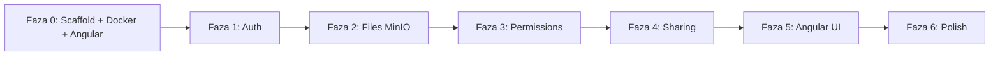

# iM.Cloud — Loyiha rejasi

> Bu fayl iM.Cloud loyihasi bo'yicha qotirilgan (kelishilgan) umumiy logikani va bajarilishi kerak bo'lgan ishlarni saqlaydi. Loyiha rivojlanishi bilan yangilanib boriladi.

---

## 1. Maqsad

Shaxsiy serverda ishlaydigan, **Nextcloud'dan yengilroq**, faqat kerakli funksiyalar bilan self-hosted cloud storage platformasi. Asosiy maqsad — shaxsiy fayllarni shaxsiy serverda saqlash va cloud sifatida foydalanish, ortiqcha funksiyalarsiz.

User model: **to'liq multi-user** (foydalanuvchi o'z fayllariga ega, kerak bo'lsa boshqalarga ulashadi).

---

## 2. Texnologik stack

| Qatlam | Texnologiya |
|--------|-------------|
| Backend | .NET 9, ASP.NET Core Web API |
| Frontend | Angular |
| Database | SQL Server (Docker) — metadata + papka ierarxiyasi |
| File storage | MinIO (S3-compatible, Docker) — fayl blob'lari |
| Auth | JWT (access + refresh token) + BCrypt |
| Arxitektura | Clean Architecture (Domain → Application → Infrastructure → API) |

---

## 3. Arxitektura prinsiplari (qat'iy)

1. **Domain** — hech qanday tashqi dependency yo'q (EF Core, ASP.NET — yo'q). Faqat sof C#.
2. **Application** — use case'lar (CQRS uslubida Command/Query), DTO'lar, interface'lar (`IFileStorageService`, `IAuthService` va h.k.).
3. **Infrastructure** — EF Core, MinIO storage, JWT servis implementatsiyalari.
4. **API** — faqat Application use case'larini chaqiradi, biznes mantiq yo'q.
5. Entity'lar **private setter** + **factory method** orqali — to'g'ridan-to'g'ri `new Entity()` yo'q.
6. Har bir use case alohida Command/Query class (bitta katta Service emas).
7. **Mediator library YO'Q** — handler'lar DI orqali inject qilinadi.

### Dependency qoidalari

| Qatlam | Ruxsat etilgan dependency |
|--------|---------------------------|
| Domain | Hech narsa |
| Application | Domain |
| Infrastructure | Application, Domain |
| API | Application, Infrastructure (faqat DI uchun) |
| Client | API (HTTP) |

---

## 4. Repo struktura

```
iM.Cloud/
├── iM.Cloud.sln
├── docker-compose.yml          # SQL Server + MinIO
├── src/
│   ├── iM.Cloud.Domain/
│   ├── iM.Cloud.Application/
│   ├── iM.Cloud.Infrastructure/
│   ├── iM.Cloud.API/
│   └── iM.Cloud.Client/        # Angular
└── PROJECT_PLAN.md
```

> Test project'lar MVP'da YO'Q — tekshirish `dotnet build` orqali.

---

## 5. Storage arxitekturasi (MinIO + SQL)

- **Papka ierarxiyasi** — faqat SQL (`FileItem` jadvali: `ParentId`, `IsFolder`). MinIO'da papka tushunchasi yo'q.
- **Fayl kontenti** — MinIO bucket'ida object (`StorageKey = {userId}/{fileId}`).
- **Metadata** (nom, owner, size, parent) — SQL Server.
- Application `IFileStorageService` interface orqali ishlaydi; MinIO implementatsiyasi Infrastructure'da.

| Operatsiya | MinIO | SQL |
|------------|-------|-----|
| Upload | PutObject | FileItem insert |
| Download | GetObject | FileItem lookup |
| Delete file | RemoveObject | FileItem delete |
| Create folder | — | FileItem insert (IsFolder=true) |
| Rename / Move | — | FileItem update |

---

## 6. Funksional scope

### MVP
1. **Authentication** — register, login, refresh token (JWT)
2. **File management** — upload, download, rename, move, delete; papka yaratish va navigatsiya
3. **Permissions** — Read / Write / Owner darajalari, fayl/papka darajasida
4. **Sharing** — foydalanuvchilar o'rtasida user-to-user ulashish

### Post-MVP (keyin)
- Groups (guruh darajasida ruxsat)
- Trash / Recycle bin (o'chirilgan faylni tiklash)
- Fayl nomi bo'yicha qidiruv
- Papkani ZIP qilib yuklab olish
- Storage quota

---

## 7. Korrektlik va xavfsizlik qoidalari (MVP'da, muzokara qilinmaydi)

1. **Owner/permission check** — har bir file so'rovida tekshiriladi (IDOR himoyasi: boshqaning faylini `id` orqali olib bo'lmaydi).
2. **Upload tartibi: MinIO → SQL.** SQL fail bo'lsa, MinIO blob o'chiriladi (yetim blob qoldirilmaydi).
3. **Papkani o'chirish = rekursiv** — barcha bolalar (SQL yozuv + MinIO blob) cascade o'chiriladi.
4. **Secret'lar `appsettings`da emas** — `dotnet user-secrets` (dev) / environment variable (prod).
5. **Fayl nomi validatsiyasi** — bo'sh / juda uzun / boshqaruv belgilari rad etiladi.

---

## 8. Bajarilish bosqichlari (har biri alohida coding task)

| # | Faza | Mazmun |
|---|------|--------|
| 0 | Foundation | Solution scaffold, `docker-compose` (SQL Server + MinIO), Angular skeleton, build verification |
| 1 | Authentication | User domain, auth use case'lar, JWT (access+refresh) + BCrypt infra, API endpoint'lar |
| 2 | File Management | FileItem domain, MinIO storage service, CRUD API |
| 3 | Permissions | Permission entity, handler'larda authorization check |
| 4 | Sharing | Share entity, share/unshare API, "shared with me / by me" |
| 5 | Angular Client | Auth, file browser, sharing UI |
| 6 | Polish | README, `.gitignore`, `.editorconfig`, EF migration'lar |



---

## 9. Domen modeli (multi-user)

```
User
├── Id (Guid)
├── Email (unique)
├── PasswordHash
├── DisplayName
└── CreatedAt

FileItem
├── Id (Guid)
├── Name
├── ParentId (nullable)
├── IsFolder (bool)
├── StorageKey (nullable — faqat fayl: "{userId}/{fileId}")
├── Size (long)
├── OwnerId (Guid → User)
├── CreatedAt, ModifiedAt
└── factory: CreateFile(...), CreateFolder(...)

Permission
├── Id, FileItemId, UserId
└── Level (Read=1, Write=2, Owner=3)

Share
├── Id, FileItemId, SharedByUserId, SharedWithUserId
├── Level (Read | Write)
└── CreatedAt
```

---

## 10. API endpoint'lar (rejalashtirilgan)

```
# Auth
POST   /api/auth/register
POST   /api/auth/login
POST   /api/auth/refresh

# Files
GET    /api/files?parentId={id}
POST   /api/files/upload
POST   /api/files/folder
GET    /api/files/{id}/download
PUT    /api/files/{id}/rename
PUT    /api/files/{id}/move
DELETE /api/files/{id}

# Permissions
POST   /api/files/{id}/permissions
DELETE /api/files/{id}/permissions/{userId}
GET    /api/files/{id}/permissions

# Sharing
POST   /api/shares
DELETE /api/shares/{id}
GET    /api/shares/with-me
GET    /api/shares/by-me
```

---

## 11. Agent uchun qoidalar

- Har bir task **kichik va aniq scope**ga ega — faqat berilgan task doirasida ishlang.
- Yangi pattern/kutubxona qo'shishdan oldin so'rang — loyiha minimalistik.
- Kod yozilgandan keyin **`dotnet build`** ishlashini tekshiring.
- Mavjud kod uslubiga (naming, struktura) rioya qiling.

---

*Keyingi qadam: Faza 0 — Solution scaffold.*
